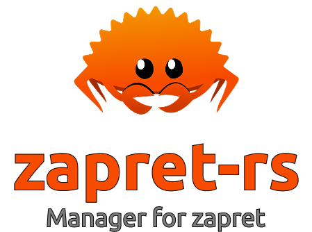

<div align="center">
  
</div>

---

### Добро пожаловать в zapret-rs
Небольшой проект zapret-rs создается и поддерживается мною для простоты развертывания и управления стратегиями zapret. Унифицируя всю логику в одном месте. Правила для стратегий код преобразует в нифицированные json файлы. Он так же умеет работать с бат файлами и преобразовывать их в json файлы. Repo - модуль для работы с репозиториями. Синтаксис файла repo.list очень простой: название репозитория, url репозитория. Если нужно, то можно указать branch и commit. Весь опыт работы с sources.list из Ubuntu/Debian тут применим. Изначально сея код - форк  Sergeydigl3/zapret-discord-youtube-linux. Возможно, проект будет развиваться и станет более универсальным.


# Как запустить

1. **Клонирование репозитория и запуск основного скрипта:**

   ```bash
   git clone https://github.com/masloffvs/zapret-rs.git
   cd zapret-rs
   git checkout stable2
   cargo build --release
   cp target/release/zapret-rs ./zapret-rs
   ./zapret-rs start
   ```

2. **Сохранение параметров:**

   Ответы можно сохранить в файле `conf.json`.
   Пример содержимого файла `conf.json`:
   
   ```bash
   {
     "strategy": "general",
     "auto_update": false,
     "interface": "wlp82s0"
   }
   ```

3. **Настройка репозиториев:**

   При первом запуске система автоматически создаст `repo.list` из `repo.list.default`.
   Вы можете отредактировать `repo.list` для добавления своих репозиториев:
   
   ```bash
   # Формат: название_репозитория URL [ветка] [коммит]
   monorepo https://github.com/masloffvs/zapret-rs-monorepo.git
   zapret-discord https://github.com/Flowseal/zapret-discord-youtube main
   ```

4. **Обновление репозиториев и стратегий:**

   ```bash
   ./zapret-rs pull
   ```

# Важно

- Скрипт работает только с **nftables**.
- При остановке скрипта все добавленные правила фаервола очищаются, а фоновые процессы `nfqws` останавливаются.
- Файл `repo.list` автоматически создается из `repo.list.default` при первом запуске.
- Пользовательские настройки в `repo.list` сохраняются при обновлениях через `git pull`.
- Система автоматически валидирует стратегии и пропускает невалидные файлы.
- Исполняемый файл `nfqws` находится в папке `bin/`.


# Автозагрузка
Пока ее нет =( 

